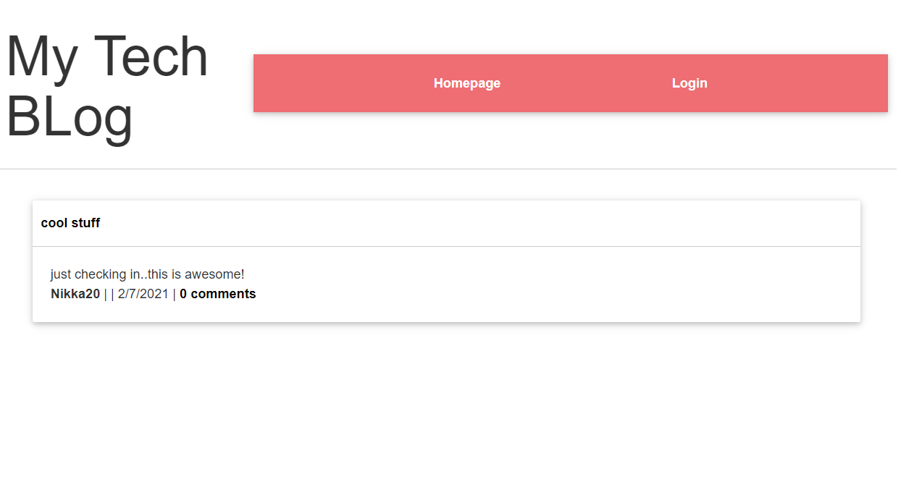

# My Tech Blog

### Description
`This is a mysql database and a blog application that is built using Model View Controller (MVC). `

### Installation
  
`npm init`

`npm install`

### Screenshot
### 
  
### Usage
#### You can clone the repository and make sure all npm packages are installed to your terminal.
  

`mysql -u root -p`

`source db/schema.sql`

`npm run seed`
  
`npm start or node server.js`

### Testing
`npm test`

### Github URL 
#### https://github.com/ArlonTuazon/just-tech-news

### Heroku URL
#### https://arlon-tech-blog.herokuapp.com/

### Using Browser
#### https://localhost:8080

